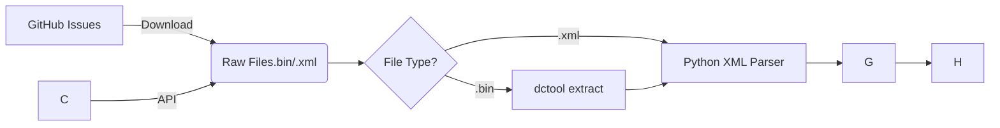

Here is a detailed research report focusing on the data mining sources and implementation strategies required to build your validation dataset.

# Research Report: Data Mining Strategy for Decompression Model Backtesting

## 1. Executive Summary

To validate the "Slab Diffusion Model" (based on Hempleman’s linear bulk diffusion theory) against the industry-standard Bühlmann ZH-L16C, you require a dataset containing thousands of real-world dive profiles. Unlike stochastic simulations, real data captures human behavior—variable ascent rates, "sawtooth" profiles, and repetitive diving sequences—that specifically stress the hysteresis effects in diffusion-limited tissue models.

This report outlines a strategy to programmatically mine three primary sources: **GitHub Issue Trackers** (for raw device dumps), **Divelogs.de** (via their new API), and **ScubaBoard** (via XenForo scraping). It also details the technical implementation for a "Headless Ingestion Pipeline" using `dctool` and Python.

---

## 2. Primary Source: GitHub Issue Mining

The most valuable source of high-fidelity data is the issue trackers for open-source diving projects. Users frequently attach raw binary dumps (`.bin`, `.dmp`) or XML logs when reporting bugs. These files are particularly useful because they often represent "edge cases" (e.g., rapid ascents, sensor errors) that break standard parsers, providing excellent stress-test data for your Slab model.

### 2.1 Target Repositories

* **`libdivecomputer/libdivecomputer`**: The gold standard for raw device data. Issues here often contain raw memory dumps from specific dive computers (Suunto, Shearwater, Mares).


* **`subsurface/subsurface`**: Users attach `.xml` log files or proprietary database files (e.g., `.uddf`, `.sql`) when reporting import errors.

### 2.2 Implementation Strategy

GitHub does not provide a direct API endpoint to "list all attachments." You must iterate through issues and parse the Markdown body text to find file links.

**The Mining Algorithm:**

1. **Authenticate**: Use `requests` with a GitHub Personal Access Token (PAT) to avoid rate limits (5,000 req/hour).
2. **Iterate Issues**: Query `GET /repos/{owner}/{repo}/issues?state=all`.
3. **Regex Extraction**: Scan the `body` field of each issue for standard GitHub attachment patterns:
`r'https://github\.com/.*?/files/(\d+)/([a-zA-Z0-9_.-]+)'`
4. **Filter & Download**: Only download relevant extensions (`.bin`, `.dmp`, `.xml`, `.uddf`, `.zip`).
5. **Metadata Association**: Save files with the Issue ID (e.g., `issue_451_dump.bin`). This allows you to manually review the issue text if the profile generates anomalous results in your Slab model.

**Python Implementation Snippet:**

```python
import requests
import re
import os

def mine_github_issues(repo_owner, repo_name, output_dir):
    url = f"https://api.github.com/repos/{repo_owner}/{repo_name}/issues"
    headers = {'Authorization': 'token YOUR_GITHUB_TOKEN'}
    
    # Pagination loop (simplified)
    params = {'state': 'all', 'per_page': 100}
    response = requests.get(url, headers=headers, params=params)
    
    for issue in response.json():
        if not issue.get('body'): continue
        
        # Regex to find GitHub file attachments
        # Looks for: [filename](https://github.com/.../files/...)
        matches = re.findall(r'\[(.*?)\]\((https://github\.com/[^/]+/[^/]+/files/\d+/.*?)\)', issue['body'])
        
        for filename, link in matches:
            ext = os.path.splitext(filename).[1]lower()
            if ext in ['.bin', '.dmp', '.xml', '.uddf']:
                print(f"Found {filename} in Issue {issue['number']}")
                # Download logic here...

```

---

## 3. Secondary Source: Community Repositories (APIs)

Structured repositories offer cleaner data but may lack the sample frequency (2-second intervals) found in raw binary dumps.

### 3.1 Divelogs.de REST API

In January 2024, the popular repository `divelogs.de` released a public RESTful API, making it a prime target for bulk data acquisition.

* **Endpoint**: `GET /dive/{dive_id}`.
* **Data Quality**: Check if the API returns profile samples (depth/time series) or just summary data. If samples are included, this is the easiest method to scale your dataset.
* **Strategy**: Write a script to iterate through `dive_id` integers. Handle 404s (deleted/private dives) and 429s (rate limits).

### 3.2 Diveboard & Kaggle

* **Kaggle**: Contains a "Scuba Diving Logbook" dataset. This is useful for demographic distribution (e.g., "What is the average depth of recreational dives?") to tune your random profile generator, but the data is often summary-only (lacking the second-by-second samples needed for diffusion integration).


* **Diveboard**: Offers GBIF exports, but primarily for biological sightings.


---

## 4. Tertiary Source: Forum Scraping

Forums like **ScubaBoard** are rich in qualitative data but require "dirty" scraping methods.

* **Platform**: ScubaBoard uses **XenForo** software.
* **Target**: The "Computer/Analyzer/Software" sub-forums where users post files for troubleshooting.
* **Scraping Tool**: Existing Python scrapers for XenForo can be adapted to look for attachment tags within thread posts.
* **Challenge**: Forums often require login cookies to download attachments. Your script must handle session authentication.

---

## 5. The Ingestion Pipeline: Normalization

Once you have downloaded thousands of mixed files (`.bin` dumps and `.xml` logs), you need a unified pipeline to convert them into a standard Time-Depth CSV format for your Slab model backtester.

### 5.1 Handling Binary Dumps (`libdivecomputer`)

Raw dumps from GitHub are unintelligible binary blobs. You must use `dctool` (from `libdivecomputer`) to parse them.

* **Tool**: `dctool` command-line utility.


* **The "Blind Extract" Technique**: Since you won't know which dive computer model created a "random.bin" file from a GitHub issue, your script should iterate through common device families (Suunto, Shearwater, Mares) using the `-f` (family) flag until `dctool` successfully extracts data.
* **Command**:
`dctool extract -f <family> -o output.xml input.bin`

### 5.2 Handling XML Logs (`subsurface`)

Files mined from the Subsurface repository are likely already in Subsurface XML format.

* **Parsing**: Use Python's `xml.etree.ElementTree`.


* **Key Fields**: You need to extract the `<sample>` nodes.
```xml
<dive>
  <sample time='0:00 min' depth='0.0 m' />
  <sample time='0:10 min' depth='1.2 m' />
</dive>

```


* **Conversion**: Write a simple Python wrapper to parse these XMLs and output a Pandas DataFrame with `Time (s)` and `Depth (m)` columns.

### 5.3 Pipeline Architecture



## 6. Implementation Notes for Slab Model Backtesting

The "Slab" model (Hempleman) differs critically from Buhlmann in how it handles "trapped" gas in the tissue slab during ascent.

* **Required Resolution**: Ensure your mining pipeline filters *out* dives with low sample rates (e.g., >30s intervals). Diffusion gradients across a slab require high-resolution data (ideally <10s) to accurately model the pressure wave moving through the tissue.
* **Missing Surface Intervals**: GitHub dumps often contain isolated dives. For the Slab model, which is sensitive to residual nitrogen, you must identify "series" of dives. In `libdivecomputer` XML output, look for the `fingerprint` or date-timestamps to reconstruct repetitive dive sequences.